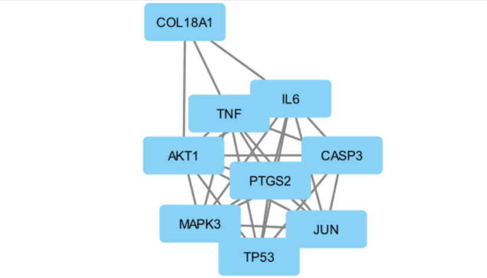
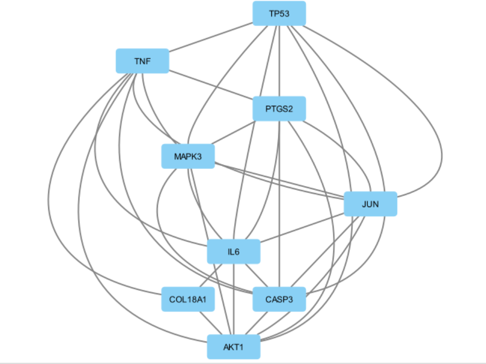
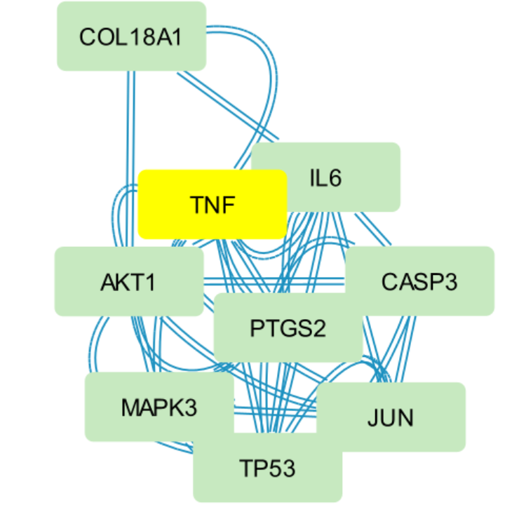
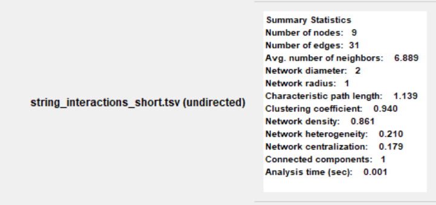
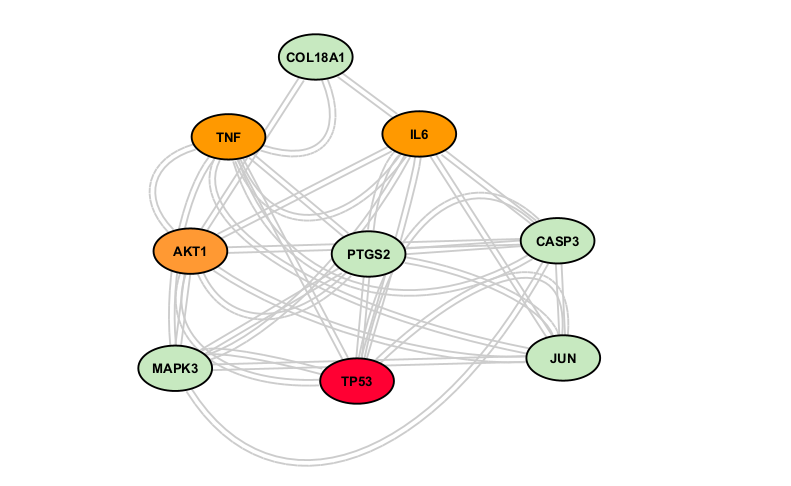

# Cytoscape

## Overview
Cytoscape is an open-source software platform used for visualizing and analyzing biological interaction networks. It is widely used in bioinformatics to analyze Protein-Protein Interaction (PPI) networks, identify hub genes, detect clusters, and customize network visualizations.

Official Website:
https://cytoscape.org/

---

# Objective

In this exercise, Cytoscape was used to:

- Import a Protein-Protein Interaction (PPI) network exported from STRING.
- Visualize the interaction network.
- Customize node color, size, and labels.
- Calculate network topology.
- Identify hub genes based on node degree.
- Produce publication-quality network figures.

---

# Dataset Used

Protein interaction network exported from STRING database.

Example genes:

- TP53
- AKT1
- TNF
- IL6
- MAPK3
- CASP3
- JUN
- PTGS2
- COL18A1

---

# Step 1 — Export Network from STRING

After generating the PPI network in STRING:

Export

TSV

or

Download → TSV (protein links)

Save the file as

string_interactions.tsv

---

# Step 2 — Import into Cytoscape

Open Cytoscape

File

Import

Network

File...

Select

string_interactions.tsv

Click

Open

The network will appear in Cytoscape.

---

# Step 3 — Apply Layout

To organize the network:

Layout

Apply Preferred Layout

or

Layout

Prefuse Force Directed Layout

This spreads the nodes and improves readability.

---

# Step 4 — Analyze the Network

Go to

Tools

Analyze Network

Select

Undirected

Click OK

Cytoscape calculates:

- Degree
- Betweenness
- Closeness
- Neighbors
- Other network statistics

A summary statistics window appears.

---

# Step 5 — View Degree Values

At the bottom panel

Click

Node Table

Scroll horizontally until you find

Degree

The Degree column shows the number of interactions for each protein.

Example:

| Gene | Degree |
|------|-------|
| AKT1 | 8 |
| IL6 | 8 |
| TNF | 8 |
| TP53 | 7 |
| CASP3 | 6 |

Genes with the highest Degree are considered hub genes.

---

# Step 6 — Identify Hub Genes

Hub genes are proteins with the highest number of interactions.

In this example:

- AKT1
- IL6
- TNF

had the highest Degree value (8).

These were selected as hub genes.

---

# Step 7 — Highlight Hub Genes

Select the hub genes.

Change node color.

Example used:

Orange

This makes hub genes easy to identify in the network.

---

# Step 8 — Change Node Size

Select nodes

Style Panel

Node

Size

Increase the value.

Example:

40

or

50

Larger nodes improve visualization.

---

# Step 9 — Change Node Shape

Style Panel

Node

Shape

Choose:

Ellipse

This provides a cleaner appearance.

---

# Step 10 — Change Label Size

Style

Label Font Size

Increase to

14

or

16

for better readability.

---

# Step 11 — Change Edge Color

Style

Edge

Stroke Color

Select

Gray

or

Light Gray

This reduces visual clutter.

---

# Step 12 — Export Figure

File

Export

Network View as Graphics

Choose

PNG

or

PDF

Save the figure.

---

# Results

Network Statistics:

- Nodes: 9
- Edges: 31
- Average Neighbors: 6.889
- Network Density: 0.861

Hub Genes:

- AKT1
- IL6
- TNF

These proteins showed the highest connectivity in the interaction network.

---

# Screenshots

## Imported STRING Network

---

## Customized Cytoscape Network

---

---

## Network Analysis Summary

---

## Hub Genes Highlighted

---

# Learning Notes

✔ Cytoscape itself does not predict hub genes.

✔ Hub genes are identified using network topology analysis.

✔ Degree represents the number of direct interactions.

✔ Higher Degree usually indicates greater biological importance.

✔ STRING generates the interaction network, while Cytoscape provides advanced visualization and network analysis.

---

# Skills Learned

- Importing biological networks
- Network visualization
- PPI analysis
- Degree calculation
- Hub gene identification
- Node styling
- Figure export
- Network topology analysis

---

# References

Shannon P, et al. (2003)

"Cytoscape: A Software Environment for Integrated Models of Biomolecular Interaction Networks."

Genome Research.

https://cytoscape.org/

https://string-db.org/
