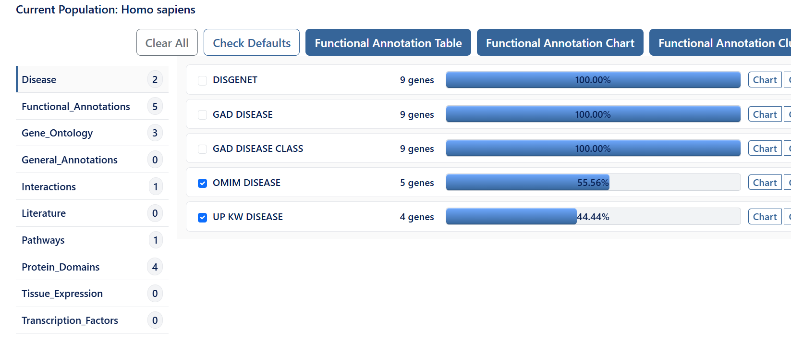
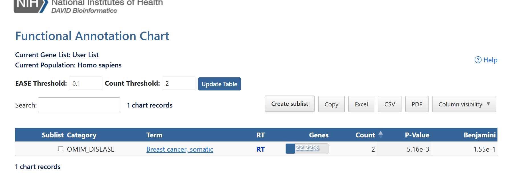
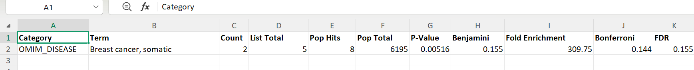

# Disease Association (OMIM)

## Overview

The Disease Association analysis in DAVID identifies diseases that are significantly associated with the submitted gene list by comparing the genes with disease databases such as OMIM (Online Mendelian Inheritance in Man).

This analysis helps determine whether the genes are known to participate in specific human diseases.

---

## Files Included

- GO-Disease.xlsx
- GO-Disease.csv
- disease-annotation-chart.png
- disease-results.png
- select-OMIM-Disease.png

---

## Workflow

### Step 1

Open the DAVID Functional Annotation Tool.

Upload the gene list using:

- Official Gene Symbol
- Gene List
- Homo sapiens

---

### Step 2

From the left panel select:

**Disease → OMIM Disease**

---

### Step 3

Click

**Functional Annotation Chart**

DAVID searches the submitted genes against the OMIM disease database.

---

### Step 4

The Disease Association table is generated.

It contains disease terms together with statistical significance values.

---

### Step 5

Export the results.

The analysis was saved as:

- GO-Disease.xlsx
- GO-Disease.csv

---

### Step 6

The significant disease associations are shown below.

---

## Output

The Disease Association table contains:

- Disease term
- Gene count
- P-value
- Benjamini corrected P-value
- Enrichment statistics

---

## Purpose

Disease Association analysis links the submitted genes with known human diseases and helps identify disease relevance using the OMIM database.
