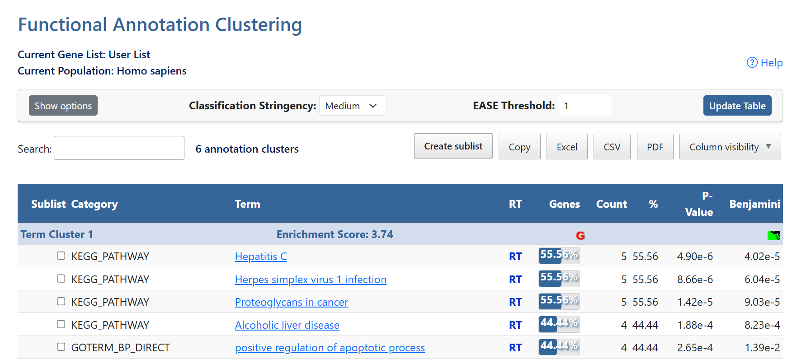
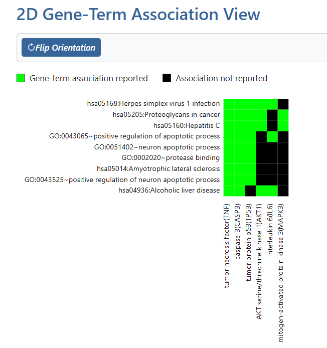
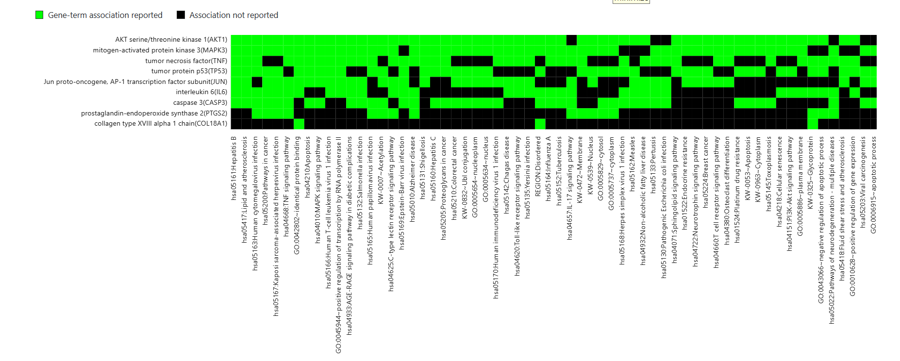
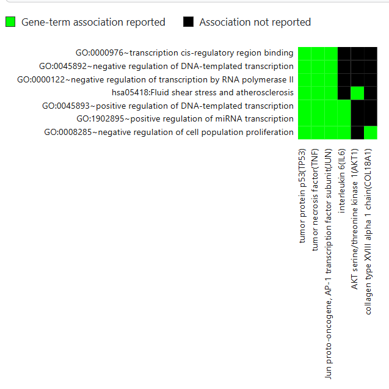
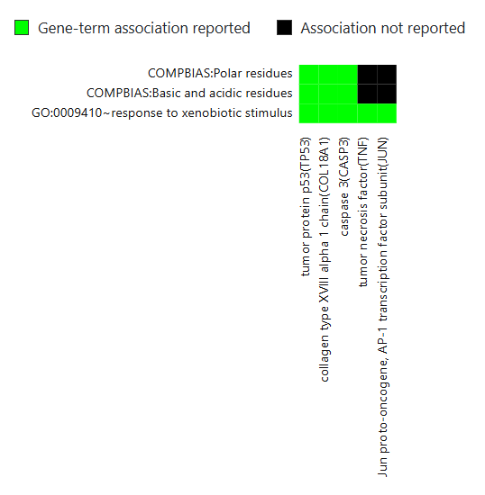
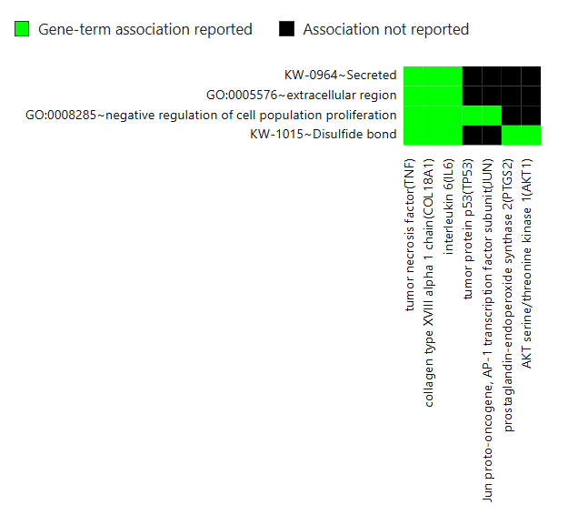
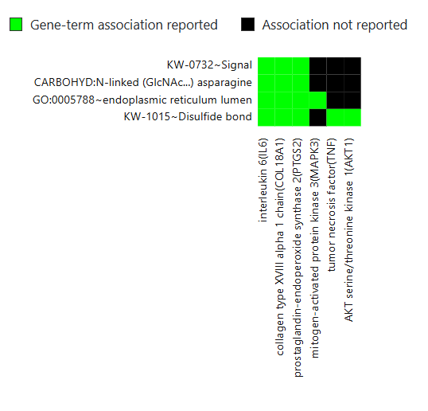

# Functional Annotation Clustering

## Overview

Functional Annotation Clustering groups related annotation terms into clusters based on shared biological meaning.

Instead of interpreting individual GO terms or pathways separately, DAVID combines similar annotations into functional clusters and assigns an Enrichment Score to each cluster.

Higher enrichment scores indicate stronger biological relevance.

---

## Files Included

- Functional-Annotation-Clustering.xlsx
- Functional-Annotation-Clustering.csv
- functional-annotation-clustering-page.png
- cluster1-gene-term-association.png
- cluster2-gene-term-association.png
- cluster3-gene-term-association.png
- cluster4-gene-term-association.png
- cluster5-gene-term-association.png
- cluster6-gene-term-association.png

---

# Workflow

## Step 1

Upload the gene list into DAVID using:

- Official Gene Symbol
- Gene List
- Homo sapiens

---

## Step 2

Click

**Functional Annotation Clustering**

DAVID automatically groups similar functional annotations into clusters.

---

## Step 3

The Functional Annotation Clustering page is displayed.

Each cluster is assigned an Enrichment Score representing the overall significance of the grouped annotations.

---

## Step 4

Export the clustering results.

The files generated are:

- Functional-Annotation-Clustering.xlsx
- Functional-Annotation-Clustering.csv

---

## Step 5

Each annotation cluster can be explored further by clicking the green Gene-Term Association icon.

This opens a 2D Gene-Term Association View showing which genes are associated with each enriched annotation term.

---

## Cluster 1

---

## Cluster 2

---

## Cluster 3

---

## Cluster 4

---

## Cluster 5

---

## Cluster 6

---

## Understanding the Gene-Term Association View

The Gene-Term Association View displays relationships between genes and enriched annotation terms.

- Green squares indicate that a gene is associated with the corresponding annotation term.
- Black squares indicate that no reported association exists.
- Rows represent enriched biological terms.
- Columns represent genes from the submitted gene list.

This visualization helps identify which genes contribute to each functional cluster.

---

## Purpose

Functional Annotation Clustering reduces redundancy among enriched annotation terms by grouping biologically related functions together, making interpretation easier and highlighting the major biological themes represented by the gene list.
