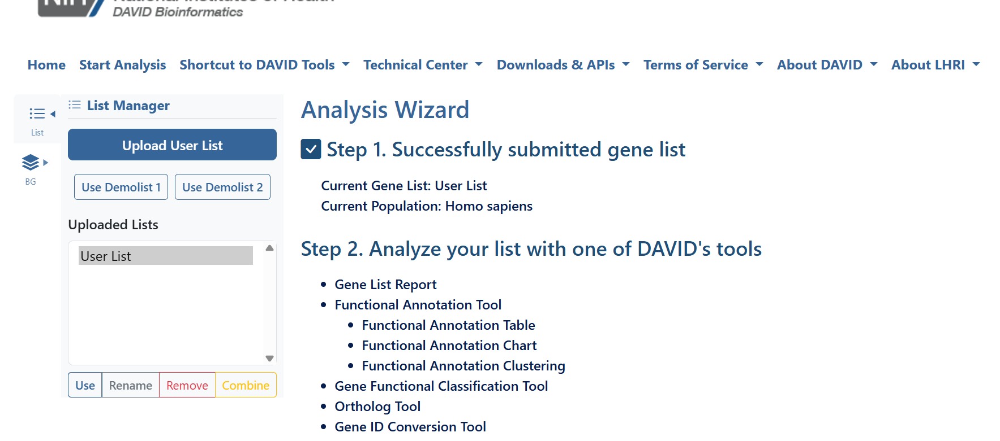
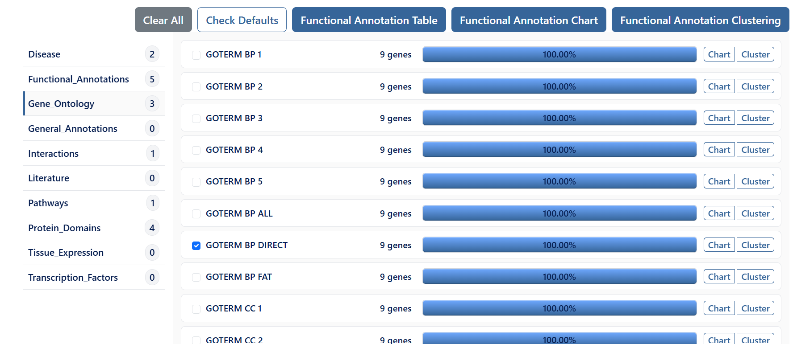
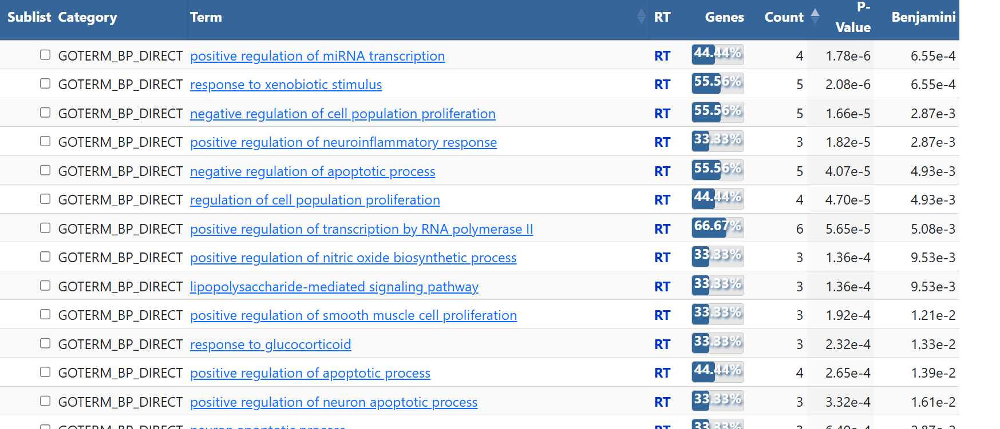
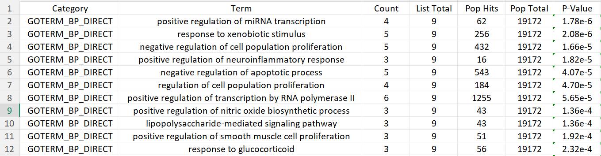

# GO Biological Process (DAVID)

## Overview

Gene Ontology (GO) Biological Process analysis identifies the biological functions and cellular processes that are significantly associated with a list of genes.

This analysis helps determine **which biological pathways or processes are overrepresented** within the uploaded genes.

Tool Used:
- DAVID (Database for Annotation, Visualization and Integrated Discovery)

Website:
https://david.ncifcrf.gov/

---

# Objective

To identify the important biological processes enriched among the selected genes.

---

# Input

Gene List:

- AKT1
- MAPK3
- TP53
- CASP3
- IL6
- TNF
- PTGS2
- JUN
- COL18A1

Species:

Homo sapiens

---

# Steps Performed

## Step 1 – Upload the Gene List

Open the DAVID website.

Upload the gene list.

Choose:

- Official Gene Symbol
- Gene List
- Homo sapiens

Click **Submit List**.

---

## Step 2 – Open Functional Annotation Tool

After the gene list is successfully uploaded, click:

**Functional Annotation Chart**

This opens the Functional Annotation Tool containing different annotation categories.

---

## Step 3 – Select Gene Ontology Category

From the left panel, click:

**Gene Ontology**

Several Gene Ontology annotation options will appear.

---

## Step 4 – Choose GO Biological Process

Select:

**GOTERM_BP_DIRECT**

This option provides directly annotated biological processes while reducing redundant GO terms.

---

## Step 5 – Generate the Annotation Chart

Click:

**Functional Annotation Chart**

DAVID generates the enriched GO Biological Process results.

---

## Step 6 – Interpret the Results

Review the enriched biological processes in the Functional Annotation Chart.

The most important columns include:

- **Term** – Name of the biological process.
- **Count** – Number of uploaded genes involved in the process.
- **P-Value** – Statistical significance of enrichment.
- **Benjamini** – Multiple testing corrected P-value (False Discovery Rate).
- **Fold Enrichment** – Degree of enrichment compared with random expectation.

---

# How to Interpret Results

## Term

Name of the biological process.

Example:

Positive regulation of miRNA transcription

---

## Count

Number of genes from the uploaded list involved in that biological process.

Example:

Count = 5

means

5 uploaded genes participate in that biological process.

---

## P-value

Measures statistical significance.

Smaller P-values indicate stronger enrichment.

Generally:

P < 0.05

is considered statistically significant.

---

## Benjamini

Benjamini-Hochberg corrected P-value (False Discovery Rate).

Preferred over raw P-values because it reduces false positive results.

Usually,

Benjamini < 0.05

is considered significant.

---

## Fold Enrichment

Indicates how much more frequently the biological process appears in the uploaded gene list compared to random expectation.

Higher values indicate stronger enrichment.

---

# Biological Processes Identified

Examples from this analysis include:

- Positive regulation of miRNA transcription
- Response to xenobiotic stimulus
- Negative regulation of cell population proliferation
- Positive regulation of neuroinflammatory response
- Negative regulation of apoptotic process
- Regulation of cell population proliferation
- Positive regulation of transcription by RNA polymerase II
- Positive regulation of nitric oxide biosynthetic process
- Lipopolysaccharide-mediated signaling pathway
- Response to oxidative stress

---

# Files Saved

The following files were saved for documentation:

- GO Biological Process results (.xlsx)
- GO Biological Process results (.csv)

---

# Interpretation

The uploaded genes are mainly involved in:

- inflammatory responses
- apoptosis regulation
- transcription regulation
- oxidative stress response
- neuroinflammatory processes
- cell proliferation

These findings suggest that the selected genes participate in multiple interconnected biological pathways relevant to disease mechanisms.

---

# Applications

GO Biological Process analysis is commonly used to:

- identify enriched biological functions
- understand disease mechanisms
- prioritize important biological pathways
- support pathway enrichment studies
- interpret gene expression datasets
- identify therapeutic targets

