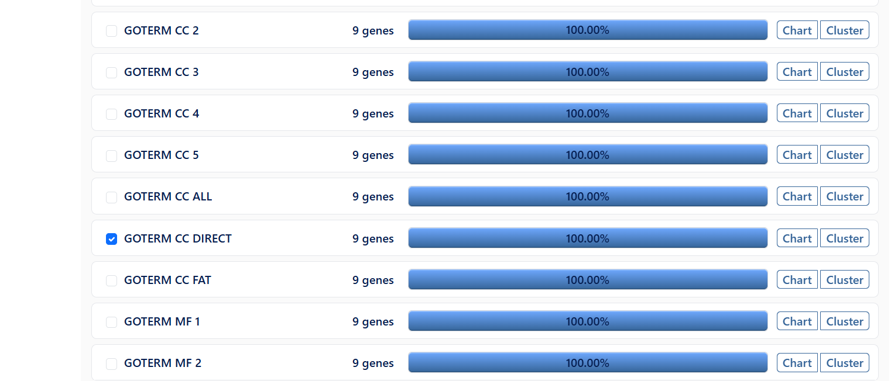
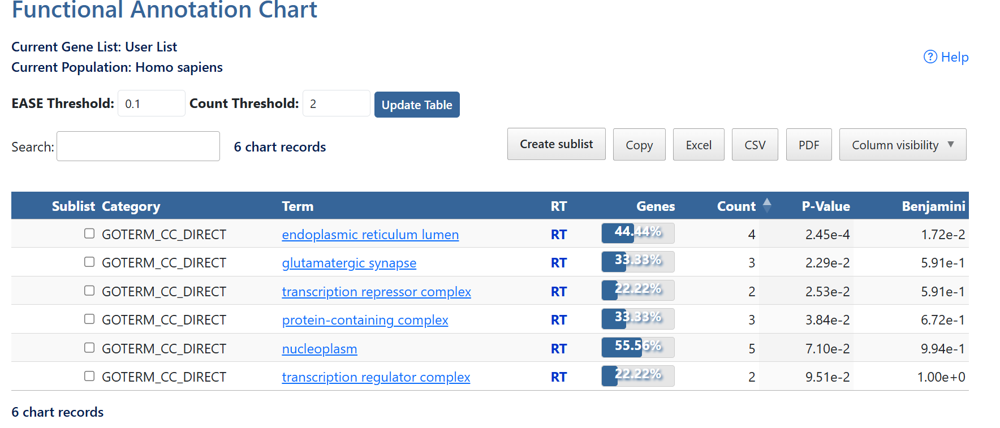
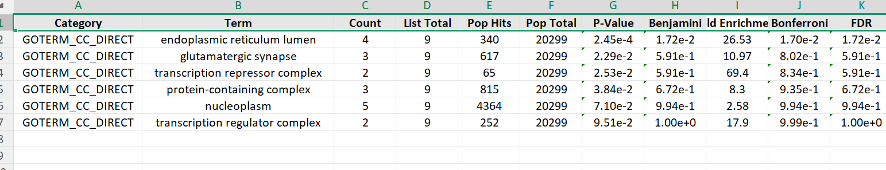

# GO Cellular Component (GO CC Direct)

## Objective

Gene Ontology (GO) Cellular Component enrichment analysis was performed using DAVID to identify the cellular locations where the target genes are mainly localized or function.

---

# Files

| File | Description |
|------|-------------|
| GO-CC-Direct.csv | GO Cellular Component enrichment results (CSV format) |
| GO-CC-Direct.xlsx | GO Cellular Component enrichment results (Excel format) |
| select-cc.png | Selecting GO Cellular Component (GOTERM_CC_DIRECT) in DAVID |
| cc-annotation-chart.png | Functional Annotation Chart generated by DAVID |
| go-cc-results.png | Exported GO Cellular Component enrichment results |
| README.md | Documentation of the analysis |

---

# Steps Performed

## Step 1

Open DAVID.

Upload the gene list.

Choose:

- Official Gene Symbol
- Gene List
- Homo sapiens

Submit the list.

---

## Step 2

From the left panel select:

**Gene Ontology**

Choose:

**GOTERM_CC_DIRECT**

This option returns directly annotated Cellular Component terms.

---

## Step 3

Click:

**Functional Annotation Chart**

DAVID generates enriched Cellular Component terms.

---

## Step 4

Export the enrichment table in both:

- CSV
- Excel

The exported results are shown below.

---

# Important Columns

| Column | Description |
|---------|-------------|
| Term | Cellular Component name |
| Count | Number of genes enriched in the term |
| P-Value | Statistical significance |
| Benjamini | Multiple testing corrected p-value |
| Fold Enrichment | Degree of enrichment |

---

# Top Enriched Cellular Components

| Cellular Component | Count | P-Value |
|--------------------|------:|---------:|
| Endoplasmic reticulum lumen | 4 | 2.45E-04 |
| Glutamatergic synapse | 3 | 2.29E-02 |
| Transcription repressor complex | 2 | 2.53E-02 |
| Protein-containing complex | 3 | 3.84E-02 |
| Nucleoplasm | 5 | 7.10E-02 |
| Transcription regulator complex | 2 | 9.51E-02 |

---

# Interpretation

The enrichment analysis indicates that the target genes are mainly associated with the **endoplasmic reticulum lumen**, suggesting involvement in protein processing and secretion. Several genes are also localized to the **glutamatergic synapse**, indicating potential roles in neuronal signaling. Enrichment in **transcription repressor complex**, **protein-containing complex**, and **transcription regulator complex** suggests participation in transcriptional regulation and protein interactions, while localization to the **nucleoplasm** indicates involvement in nuclear biological processes.

---

# Software Used

- DAVID Bioinformatics Resources
- Homo sapiens gene database
- GO Cellular Component (GOTERM_CC_DIRECT)

