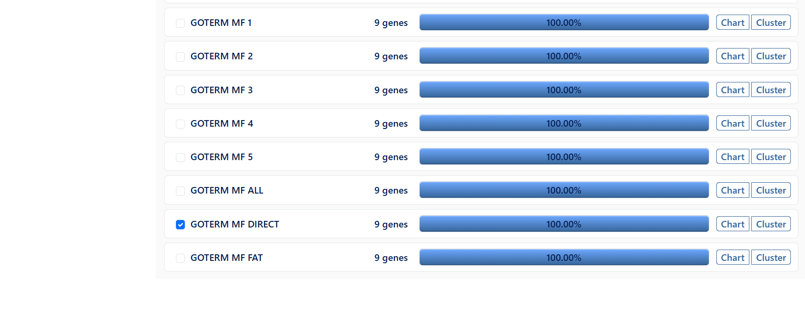
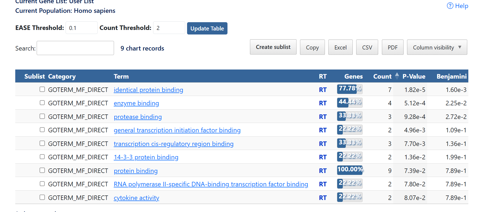
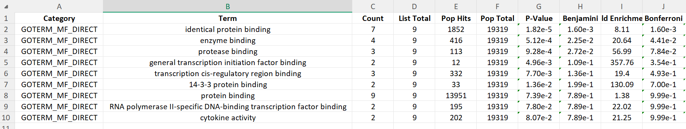

# GO Molecular Function (DAVID)

## Overview

Gene Ontology (GO) Molecular Function (GO MF) analysis identifies the molecular activities performed by proteins, such as protein binding, enzyme binding, catalytic activity, and transcription factor interactions.

This analysis was performed using the **DAVID Functional Annotation Tool** with the **GOTERM_MF_DIRECT** annotation category to identify significantly enriched molecular functions among the selected genes.

---

# Tool Used

- DAVID Bioinformatics Resources
- Functional Annotation Chart
- GOTERM_MF_DIRECT
- Species: *Homo sapiens*

---

# Input Gene List

```
AKT1
CASP3
COL18A1
IL6
JUN
MAPK3
PTGS2
TNF
TP53
```

---

# Steps Performed

## Step 1

Open DAVID.

Upload the gene list.

Choose:

- Official Gene Symbol
- Gene List
- Homo sapiens

Submit the gene list.

---

## Step 2

Navigate to

**Gene Ontology → GOTERM_MF_DIRECT**

This option identifies significantly enriched Molecular Function terms directly associated with the uploaded genes.



---

## Step 3

Click

**Functional Annotation Chart**

DAVID generates enriched Molecular Function terms together with statistical significance.



---

## Step 4

Download the enrichment results in both CSV and Excel formats for future analysis.

Files included:

- GO_MF_Direct.csv
- GO_MF_Direct.xlsx

---

## Step 5

Review the significantly enriched molecular functions.

The main columns include:

- Term
- Count
- P-Value
- Benjamini
- Genes



---

# Significant Molecular Functions

The most significant molecular functions identified in this analysis include:

| Molecular Function | Count | P-Value |
|--------------------|------:|---------:|
| Identical protein binding | 7 | 1.82E-05 |
| Enzyme binding | 4 | 5.12E-04 |
| Protease binding | 3 | 9.28E-04 |
| General transcription initiation factor binding | 2 | 4.96E-03 |
| Transcription cis-regulatory region binding | 3 | 7.70E-03 |

---

# Interpretation

The enrichment analysis indicates that the selected genes mainly participate in protein–protein interactions, enzyme binding, and regulation of transcription.

Several genes also contribute to protease binding and transcription factor binding, suggesting important roles in cellular signalling, inflammation, apoptosis, and gene regulation.

---

# Output Files

```
GO Molecular Function/
│
├── README.md
├── select-mf.png
├── mf-annotation-chart.png
├── go-mf-results.png
├── GO_MF_Direct.csv
└── GO_MF_Direct.xlsx
```

---

# Learning Outcome

Through this analysis, I learned:

- How to perform GO Molecular Function enrichment analysis using DAVID.
- How to use the GOTERM_MF_DIRECT annotation category.
- How to interpret enrichment statistics including P-value and Benjamini correction.
- How to identify significant molecular functions associated with a gene set.
- How to export and document enrichment analysis results.

---

# References

- Huang DW, Sherman BT, Lempicki RA. DAVID Bioinformatics Resources.
- Gene Ontology Consortium.
