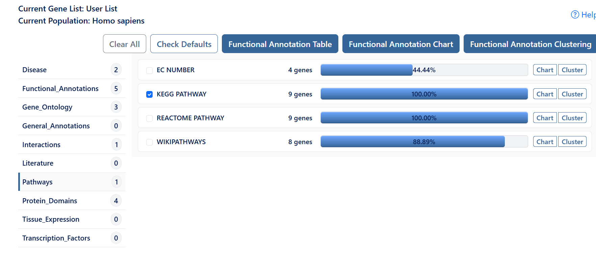
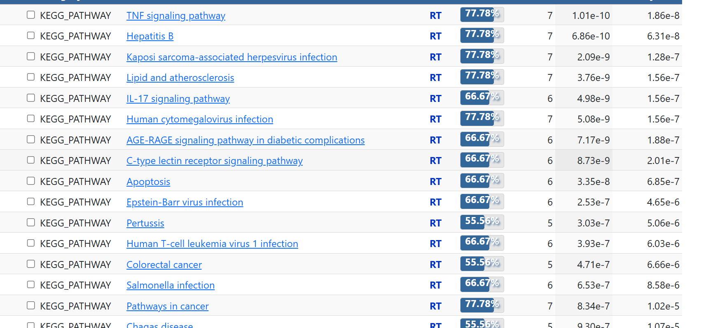
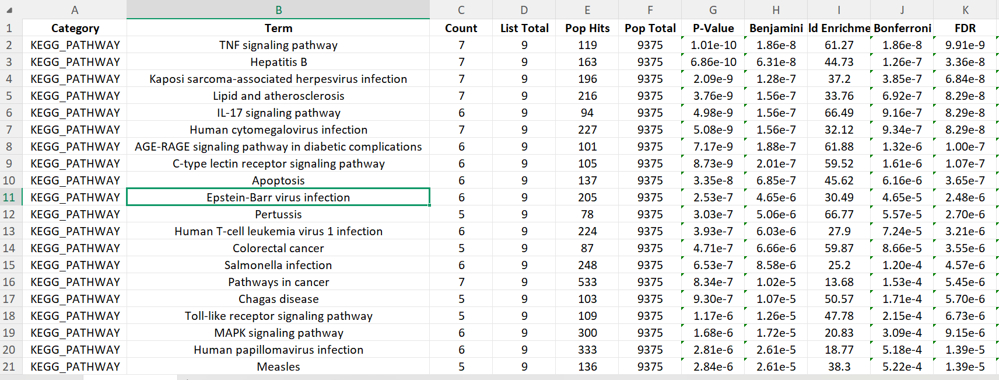

# KEGG Pathway Analysis (DAVID)

This folder contains the KEGG pathway enrichment analysis performed using DAVID.

---

# Objective

To identify biological pathways significantly enriched among the selected target genes.

---

# Input

Gene List:

- AKT1
- CASP3
- COL18A1
- IL6
- JUN
- MAPK3
- PTGS2
- TNF
- TP53

Species:

Homo sapiens

---

# Software

- DAVID Functional Annotation Tool

---

# Steps Performed

## Step 1

Open DAVID.

Upload the gene list.

Choose:

- Official Gene Symbol
- Gene List
- Homo sapiens

Submit the list.

---

## Step 2

Open **Functional Annotation Chart**.

---

## Step 3

From the left panel select:

**Pathways**

---

## Step 4

Choose:

**KEGG_PATHWAY**

This option identifies biological pathways significantly enriched in the uploaded gene list.

---

## Step 5

Click:

**Functional Annotation Chart**

DAVID generates a ranked table of enriched KEGG pathways.

---

## Step 6

Review the results.

Important columns include:

- Term
- Count
- P-Value
- Benjamini
- Fold Enrichment

---

# Top Enriched KEGG Pathways

| Pathway | Count | P-value |
|----------|------:|---------:|
| TNF signaling pathway | 7 | 1.01E-10 |
| Hepatitis B | 7 | 6.86E-10 |
| Kaposi sarcoma-associated herpesvirus infection | 7 | 2.09E-09 |
| Lipid and atherosclerosis | 7 | 3.76E-09 |
| IL-17 signaling pathway | 6 | 4.98E-09 |
| Human cytomegalovirus infection | 7 | 5.08E-09 |
| AGE-RAGE signaling pathway in diabetic complications | 6 | 7.17E-09 |
| C-type lectin receptor signaling pathway | 6 | 8.73E-09 |
| Apoptosis | 6 | 3.35E-08 |

---

# Interpretation

The KEGG pathway analysis showed that the selected genes are significantly enriched in inflammatory, immune response, apoptosis, and oxidative stress-related pathways. The strongest enrichment was observed for the TNF signaling pathway, indicating its central role in regulating inflammation and cellular responses. Other highly enriched pathways, including IL-17 signaling, AGE-RAGE signaling, and apoptosis, further support the involvement of these genes in inflammatory and cell survival mechanisms.

---

# Files Included

- KEGG_Pathway.csv
- KEGG_Pathway.xlsx
- select-kegg.png
- kegg-annotation-chart.png
- kegg-results.png
- README.md
