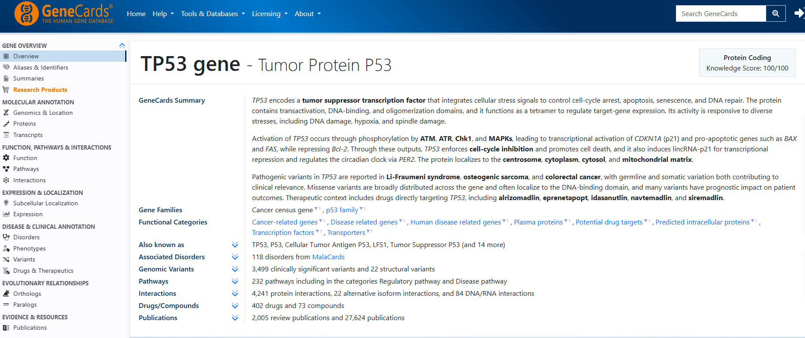
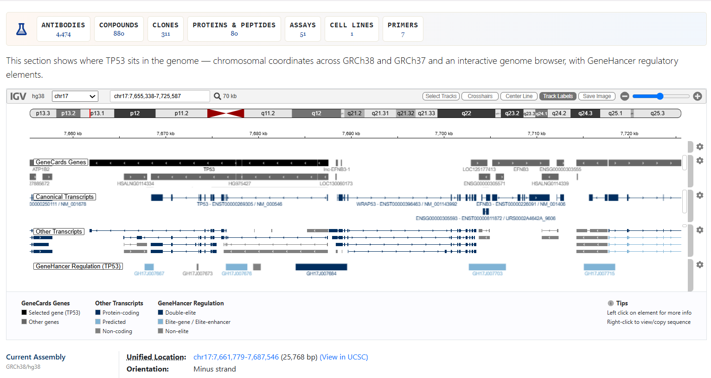
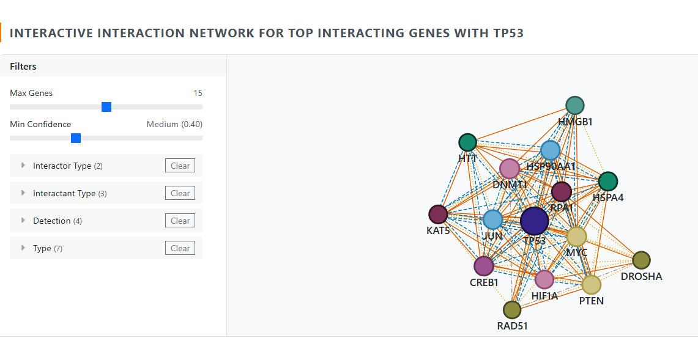
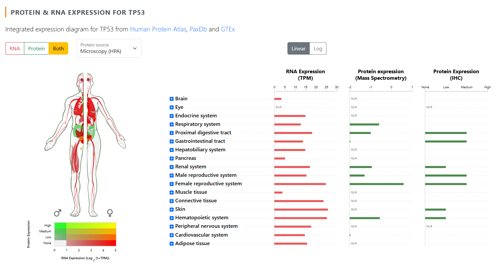
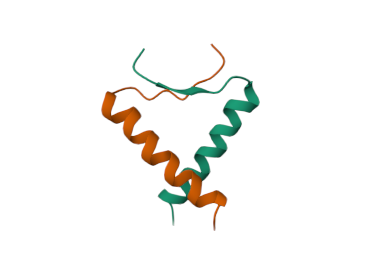

# GeneCards

## What is GeneCards?

GeneCards is a comprehensive human gene database that provides detailed information about genes, proteins, diseases, pathways, and biological functions.

---

## Website

https://www.genecards.org/

---

## Used For

- Gene search
- Disease association
- Gene function
- Expression data
- Protein information

---

## Example

TP53

Observe:

- Gene Summary
- Aliases
- Protein
- Diseases
- Pathways
- Publications

---

## My Notes

- The TP53 gene is a critical tumor suppressor on chromosome 17p that produces the p53 protein.
  called guardian of the genome.
-  232 pathways
-  30 Tissues and Cells for the gene TP53
-  There are 118 unified disorders from MalaCards associated with the gene TP53
-  217 Human Phenotypes for the gene TP53
-  402 drugs for the gene TP53
  
---

## Screenshots

## TP53 gene Overview

---

## Location of TP53 gene

---
## Molecular Interaction of Interactive genes with TP53

---

## Protein & RNA Expression of TP53

---

## Protein Structure of TP53

---

## References

GeneCards Official Website
