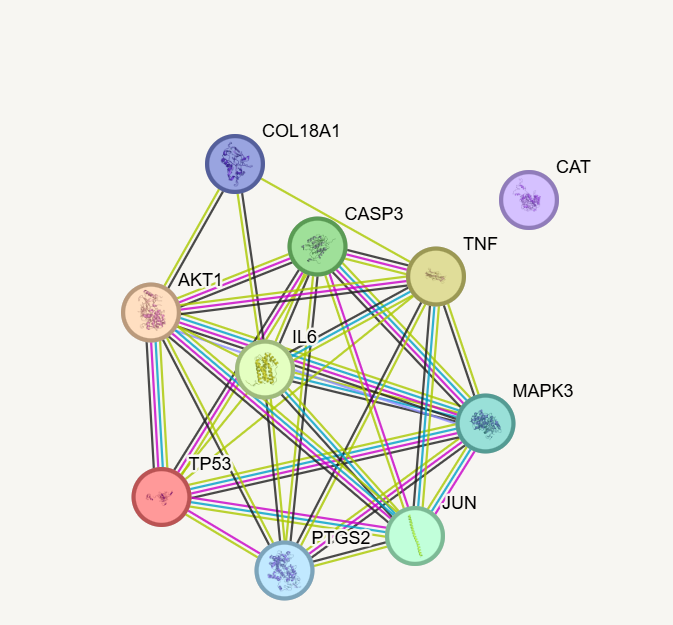
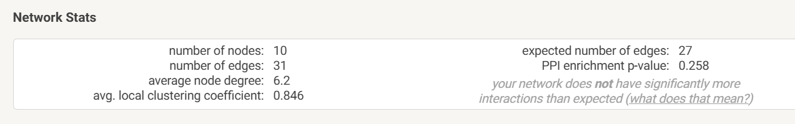
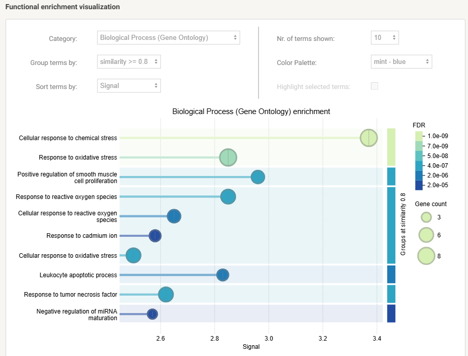

# STRING Database

## Overview

STRING (Search Tool for the Retrieval of Interacting Genes/Proteins) is an online database used to predict and visualize protein–protein interaction (PPI) networks. It integrates known and predicted interactions from experimental studies, curated databases, computational predictions, and scientific literature.

Website: https://string-db.org/

---

# Purpose

STRING helps researchers:

- Explore protein–protein interactions (PPI)
- Identify hub proteins
- Analyze biological pathways
- Perform functional enrichment analysis
- Export networks for Cytoscape
- Understand molecular mechanisms of diseases

---

# My Learning Objectives

While learning STRING, I practiced:

- Searching proteins
- Creating PPI networks
- Understanding interaction confidence scores
- Reading network statistics
- Exploring functional enrichment
- Exporting interaction networks
- Preparing networks for Cytoscape analysis

---

# Workflow

Gene/Protein List
        →
Import into STRING
        →
Protein Interaction Network
        →
Network Statistics
        →
Functional Enrichment Analysis
        →
Export to Cytoscape

---

# Example from My Final Year Project

In my undergraduate bioinformatics research project, STRING was used to construct the Protein–Protein Interaction (PPI) network of common therapeutic targets involved in skin cancer.

Target proteins included:

- TP53
- AKT1
- TNF
- IL6
- CASP3
- JUN
- MAPK3
- PTGS2
- COL18A1
- CAT

---

# Protein–Protein Interaction Network

The figure below shows the interaction network generated using STRING.

---

# Network Statistics

STRING provides several useful network metrics, including:

- Number of nodes
- Number of edges
- Average node degree
- Average local clustering coefficient
- PPI enrichment p-value

Example:

---

# Functional Enrichment

STRING identifies significantly enriched biological processes and pathways associated with the uploaded proteins.

Examples include:

- GO Biological Process
- Molecular Function
- Cellular Component
- KEGG Pathways

Example:

---

# Understanding the Network

### Nodes
Each circle represents a protein.

### Edges
Each line represents an interaction between two proteins.

### Confidence Score
Indicates how reliable an interaction is based on available evidence.

## What are Hub Proteins?

Hub proteins are proteins with a high number of interactions (connections) within a protein–protein interaction (PPI) network. They often play central roles in biological pathways and disease mechanisms.

Hub proteins are commonly identified using Cytoscape (CytoHubba plugin), where proteins are ranked based on network topology measures such as Degree, MCC, Closeness, and Betweenness Centrality.

---

# Evidence Sources Used by STRING

STRING integrates information from multiple evidence channels:

- Experimental data
- Curated databases
- Text mining
- Co-expression
- Gene neighborhood
- Gene fusion
- Gene co-occurrence

---

# Export Options

STRING allows exporting networks in multiple formats for downstream analysis.

Common export formats include:

- PNG
- TSV
- TSV (protein links)
- XGMML
- GraphML

These files can be imported into Cytoscape for advanced visualization and network analysis.

---

# Skills Learned

After completing this exercise, I learned how to:

- Build protein interaction networks
- Interpret network topology
- Identify hub proteins
- Perform enrichment analysis
- Export interaction data
- Integrate STRING with Cytoscape

---

# References

- STRING Database: https://string-db.org/
- Szklarczyk D, et al. STRING v12: protein–protein association networks supporting functional discovery in genome-wide experimental datasets. *Nucleic Acids Research.*
