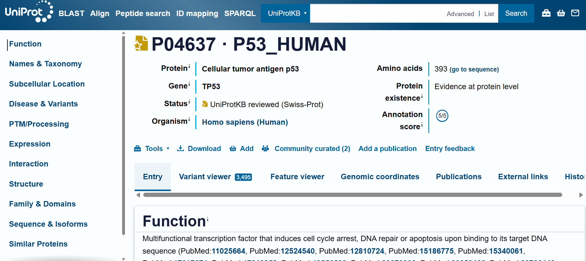
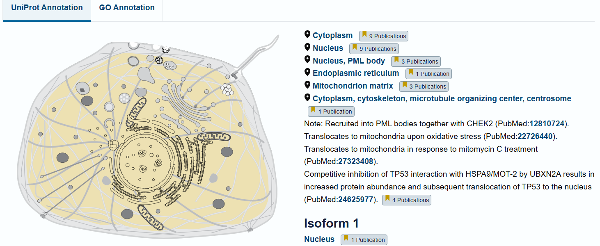
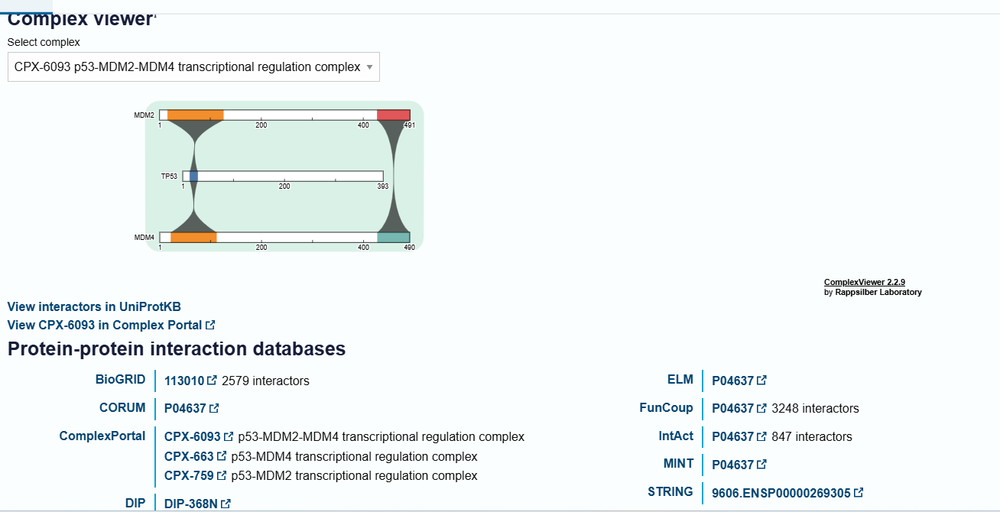
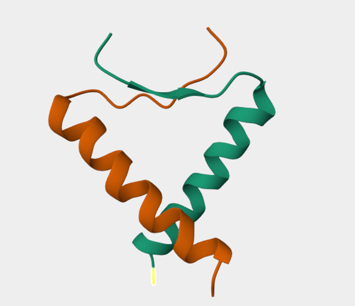

# UniProt

## What is UniProt?

UniProt is a comprehensive protein knowledgebase providing detailed information about proteins, including their biological function, sequence, structure, localization, interactions, and associated diseases.

## Website:
https://www.uniprot.org/

---

## Why I Used UniProt

During my Final Year Project, UniProt was used to obtain detailed protein information for the selected target proteins involved in skin cancer.

The information collected included:

- Protein Function
- Subcellular Location
- Protein Structure
- Protein Sequence
- Protein Interactions
- Disease Associations

---

# Example: TP53 Protein

## Protein Overview

The TP53 protein page provides a summary including:

- Protein Name
- Gene Name
- Organism
- Protein Length
- Evidence Level
- Accession Number

---

## Subcellular Location

This section shows where the protein is located inside the cell.

Examples include:

- Nucleus
- Cytoplasm
- Cell membrane
- Mitochondria

---

## Interaction

UniProt provides interaction information showing proteins that interact with the selected protein.

---

## Structure

The Structure section links experimental or predicted protein structures.

These structures can later be used for molecular docking studies.

---

# Importance in Bioinformatics

UniProt is one of the most important biological databases because it integrates information from multiple biological resources into one platform.

It is widely used for:

- Protein annotation
- Drug target identification
- Functional analysis
- Network pharmacology
- Molecular docking
- Systems biology

---

# Skills Learned

✔ Searching proteins

✔ Reading protein annotations

✔ Understanding protein functions

✔ Exploring protein interactions

✔ Studying protein localization

✔ Accessing protein structures

✔ Downloading protein sequences
